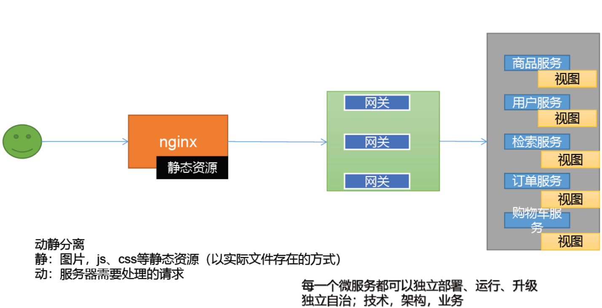
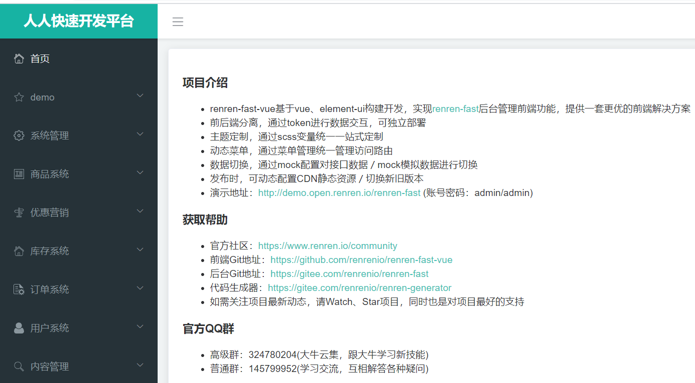
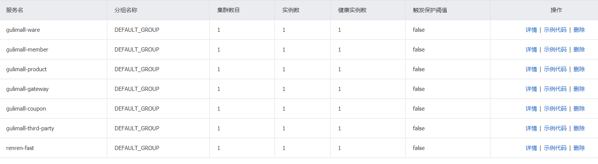

**项目简介**：尚硅谷**《谷粒商城》**2020最新版，源码是根据视频手敲，难免有纰漏，望斧正。

**视频地址**：https://www.bilibili.com/video/av967612226/

**笔      记**：[笔记参考](http://www.jayh.club/#/02.PassJava%E6%9E%B6%E6%9E%84%E7%AF%87/03.%E6%90%AD%E5%BB%BA%E7%AE%A1%E7%90%86%E5%90%8E%E5%8F%B0)

 项目GITEE地址： https://gitee.com/cosmoswong/mall ，如果代码拉取速度慢，图片不加载请移步到Gitee。

## 1. 概览

微服务架构图

项目微服务：

项目的前端页面：

后台管理页面：

项目所创建的微服务

调用端口：

| 服务名               | 端口  |
| -------------------- | ----- |
| gulimall-ware        | 11000 |
| gulimall-member      | 8000  |
| gulimall-product     | 10000 |
| gulimall-gateway     | 88    |
| gulimall-coupon      | 7000  |
| gulimall-third-party | 30000 |
| renren-fast          | 8080  |
| gulimall-order       | 9000  |
| gulimall-search      | 12000  |

## FAQ

### 1、[微服务太多，管理起来不方便](https://shimo.im/docs/WTPpdrDt66HxCQx6/)

### 2、[SPU管理中，修改商品规格，显示400错误状态码](https://shimo.im/docs/wpTxdcHpYRRV3dc6/)

### 笔记

#### 1）分布式基础

#### 2）分布式高级

* [分布式高级](https://gitee.com/cosmoswong/markdownblog/blob/master/%E8%B0%B7%E7%B2%92%E5%95%86%E5%9F%8E/%E8%B0%B7%E7%B2%92%E5%95%86%E5%9F%8E%E2%80%94%E5%88%86%E5%B8%83%E5%BC%8F%E9%AB%98%E7%BA%A7.md)
- [《商城业务-商品上架(128-135)》](https://shimo.im/docs/WWhRX8trqVtRckGj/)
- [《商城业务-首页(136-138)》](https://shimo.im/docs/YXGWCTXdxGPxrVDQ/)
- [《商城业务-nginx-搭建域名访问环境(139-140)》](https://shimo.im/docs/9PVgxCPh6VVYr9jG/ )

- [《性能压测(141-150)》](https://shimo.im/docs/6yCRVxdQvvGHG8tP/ )

- [《缓存（151-172）》](https://shimo.im/docs/hYwPXtcqcWgJjcGH/ )

#### 3）集群

* [高可用集群](https://gitee.com/cosmoswong/markdownblog/blob/master/%E8%B0%B7%E7%B2%92%E5%95%86%E5%9F%8E/%E8%B0%B7%E7%B2%92%E5%95%86%E5%9F%8E%E2%80%94%E9%AB%98%E5%8F%AF%E7%94%A8%E9%9B%86%E7%BE%A4.md)

